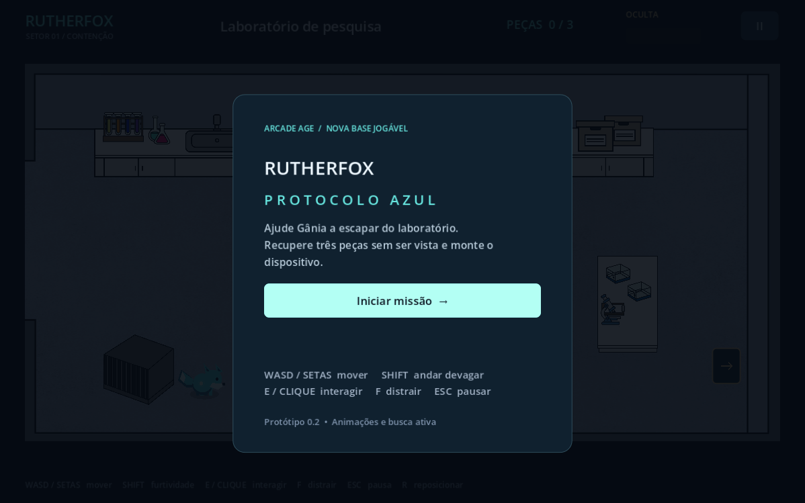
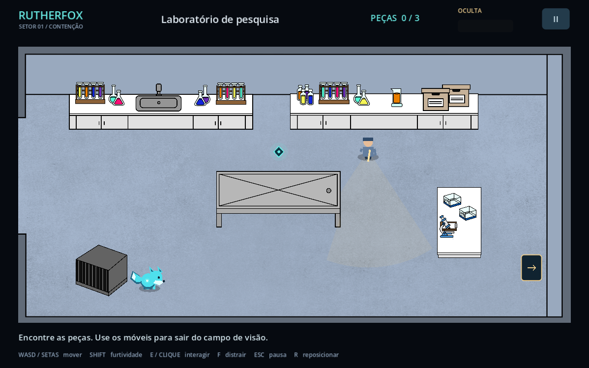
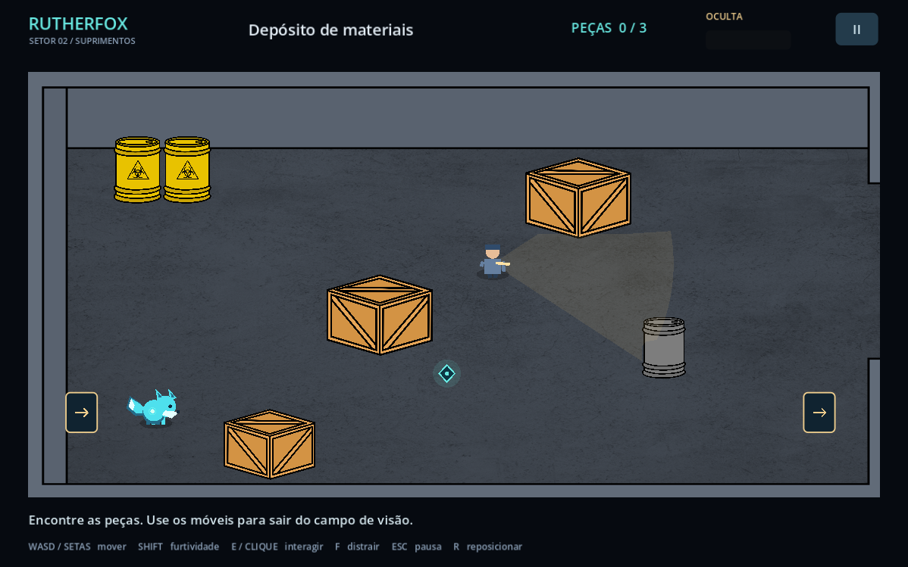
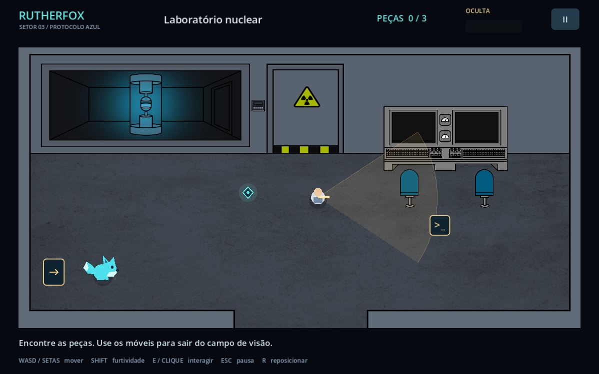

# Game_RutherFox

Uma nova base em **Godot 4.7.2 / GDScript** para o RutherFox, da Arcade Age. Protótipo de aventura e furtividade 2D com visão de cima, para computador.

Gânia é uma raposa azul e radioativa. Nesta primeira missão, explore três setores, encontre as peças de um dispositivo e monte-o sem ser capturada.

## Imagens do jogo

Capturas do protótipo rodando no Godot 4.7.2. Os cenários usam as artes originais fornecidas; os personagens ainda são provisórios.

### Menu inicial



### Laboratório de pesquisa

Gânia explora o primeiro setor enquanto evita o campo de visão do guarda.



### Depósito de materiais

Caixas e barris formam obstáculos para a exploração e a furtividade.



### Laboratório nuclear

O setor final abriga o terminal de montagem do dispositivo.



## Abrir e jogar

**Neste computador:** dê dois cliques em `Jogar.cmd`. Ele usa o Godot portátil baixado na pasta de trabalho desta entrega. Se mover o repositório para outro lugar, siga os passos abaixo ou configure `GODOT_BIN`.

1. Instale ou abra a versão padrão do [Godot 4.7.2](https://godotengine.org/download/windows/) (não precisa de .NET).
2. Importe `project.godot` nesta pasta.
3. Aguarde a importação das imagens e pressione **F6** com `scenes/main.tscn` aberta, ou **F5** para executar o projeto.

As imagens leves já estão incluídas. Os arquivos originais não são necessários para rodar.

| Ação | Controle |
|---|---|
| Mover | WASD ou setas |
| Andar devagar / reduzir distância de detecção | Shift |
| Interagir | E, ou clique no objeto quando estiver perto |
| Pausar / continuar | Esc |
| Reposicionar na entrada da sala | R |

**Objetivo:** recuperar a bobina na pesquisa, a célula no depósito e o módulo no laboratório nuclear; depois ativar o terminal nuclear. Os cones indicam o campo de visão. Móveis bloqueiam a visão e o movimento. A barra de alerta sobe enquanto Gânia é vista e diminui quando ela sai de vista. Ao ser capturada, as peças recuperadas são mantidas.

O progresso é salvo localmente ao coletar peças e trocar de sala. **Continuar progresso** retoma a sala e as peças; **Iniciar missão** começa um novo progresso. Posição e estado da patrulha não são salvos.

## O que já funciona

- Menu, pausa, captura, tentativa novamente e conclusão.
- Três salas conectadas usando as artes fornecidas.
- Movimento diagonal normalizado, colisões e caminhada lenta.
- Patrulha, cone de visão, obstrução por móveis e medidor de detecção.
- Interação por proximidade, inventário de três peças e terminal condicionado à coleta.
- Progresso local versionado e validado antes de carregar.
- Teste de integração que percorre as principais regras da missão.

## Organização

```text
assets/
  concepts/             desenhos de referência originais
  lab1/, lab2/, storage/ PNG originais intactos; ignorados pelo importador
  runtime/              cópias leves utilizadas pelo jogo
data/rooms.json         cenários, objetos, colisões, patrulhas e interações
scenes/main.tscn        cena de entrada
scripts/main.gd         sessão, progressão e interface
scripts/player.gd       movimento e personagem provisório
scripts/guard.gd        patrulha e percepção
scripts/interactable.gd indicadores de interação
tools/prepare_assets.gd preparação reproduzível das imagens
tests/                  validação e captura de prévias
docs/                   referências, decisões e inventário
```

## Desenvolvimento

Compatibilidade validada no Godot **4.7.2**, renderizador Compatibility. Não usa pacotes externos nem serviços online.

```powershell
godot --headless --path . --editor --import
godot --headless --path . --script tests/smoke.gd
```

Para regenerar as imagens leves, mantendo os originais:

```powershell
godot --headless --path . --script tools/prepare_assets.gd
godot --headless --path . --editor --import
```

Configure a variável `APPDATA` para uma pasta temporária ao testar se quiser isolar os dados do jogador. O teste de integração desativa a gravação de progresso.

## Escopo e próximos passos

Esta é uma reconstrução inicial baseada nas referências, não uma recuperação do código antigo. **Protocolo Azul** é um subtítulo provisório desta implementação. As posições, patrulhas e regras de detecção são novas decisões de prototipagem.

Os pacotes fornecidos contêm cenários e objetos, mas não sprites de personagens, áudio nem projeto Godot. Raposa e guarda usam desenhos vetoriais provisórios. A primeira missão termina na montagem do dispositivo; a transformação dos responsáveis, diálogos e cutscenes não foram recriados.

Próximos passos sugeridos: incorporar animações originais; transformar cada sala em cena editável; ampliar IA com investigação e retorno à patrulha; incluir áudio; calibrar dificuldade; adaptar UI para outros tamanhos; implementar a continuação narrativa.

Referências, créditos e classificação dos materiais: [docs/REFERENCIAS.md](docs/REFERENCIAS.md). Consulte [docs/ASSETS.csv](docs/ASSETS.csv) para origem e integridade de cada PNG.

## Direitos e créditos

RutherFox e artes originais: Arcade Age e respectivos autores. Créditos confirmados na página do projeto estão nas referências. Não foi encontrada uma licença de redistribuição nos ZIPs: nenhuma licença aberta foi atribuída às artes. Antes de publicar os materiais, confirme as permissões com seus autores. Repositório público: https://github.com/SouBeatrizKaroline/Game_RutherFox.
